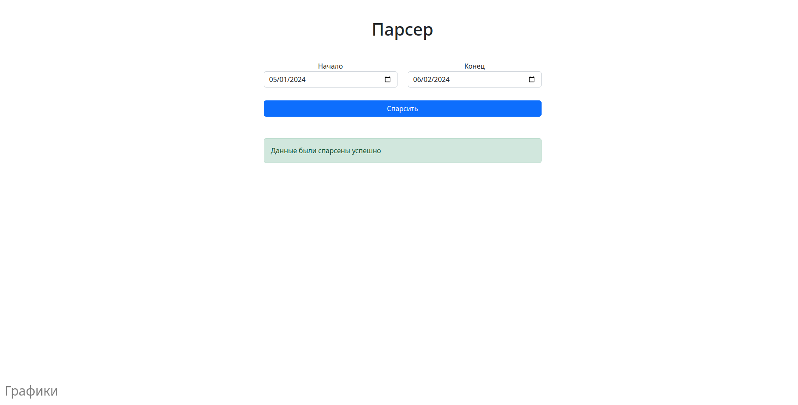
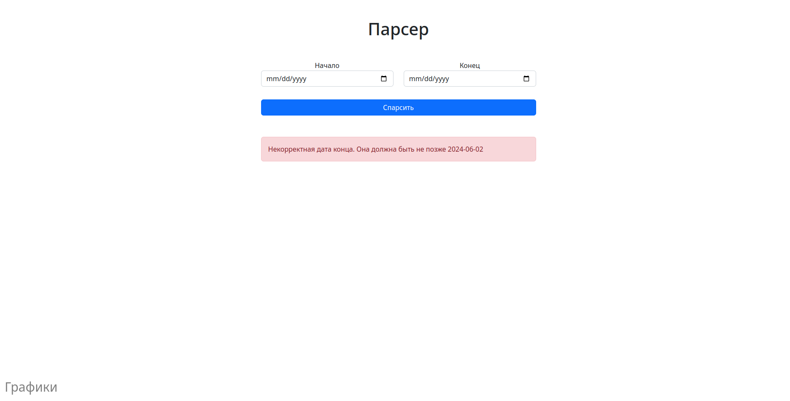
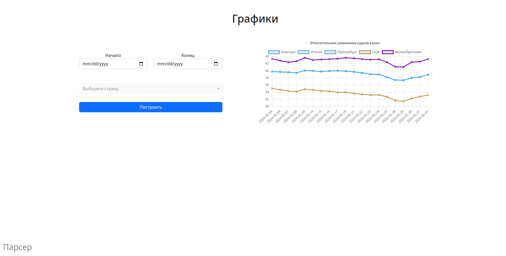
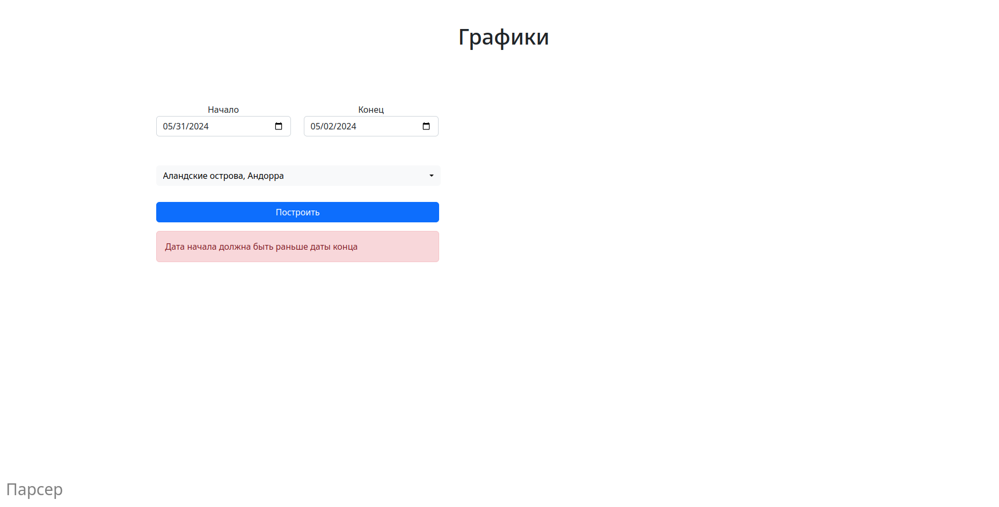

# Currency Parser

### Что было реализовано:  
1. Веб-интерфейс считывания данных  

Выдает ошибки при некорректных запросах, как, например, в случае введения даты позже, чем сегодня  


2. Веб-интерфейс относительных изменений курсов  

Также выдающий ошибки в случае некорректных данных



### Используемые технологии

* `SQLite` для БД
* `Poetry` для зависимостей
* `Requests, BS4` для парсинга
* `FastAPI, JinjaTemplates` для веб-приложения
* `Bootstrap, jQuery, Chart.js` для верстки и построения графиков


### Запуск

Подготовка, установка зависимостей:  
```shell
pip install poetry
poetry install
source .venv/bin/activate
```

Последняя команда для linux, но на windows активировать несложнее. Можете даже не пользоваться `poetry`, а воспользоваться файлом `requirements.txt`

Непосредственно запуск:  
```shell
python main.py
```

Теперь идем на [localhost](http://localhost:8000) и видим сайт

Сначала необходимо спарсить данные для построения графиков, поэтому идем в [парсер](http://localhost:8000/parser), выбираем даты
 и лишь затем переходим любоваться [графиками](http://localhost:8000)

Файл с БД (`database.db`) можно удалить, программа создаст его заново
